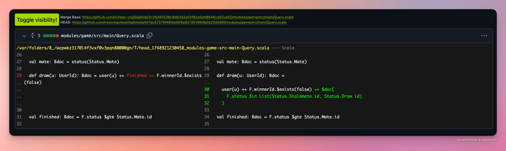
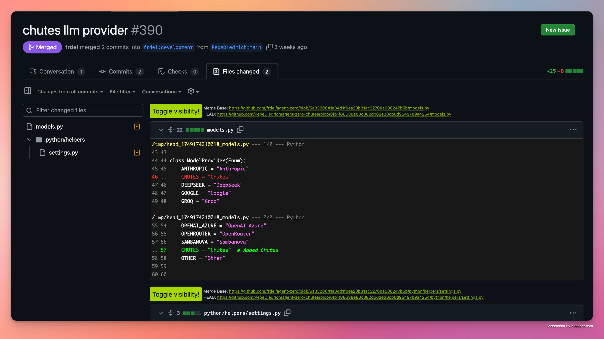
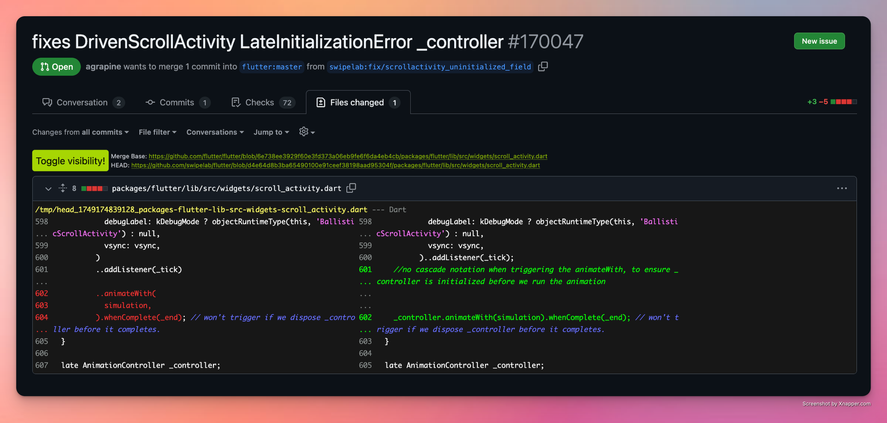
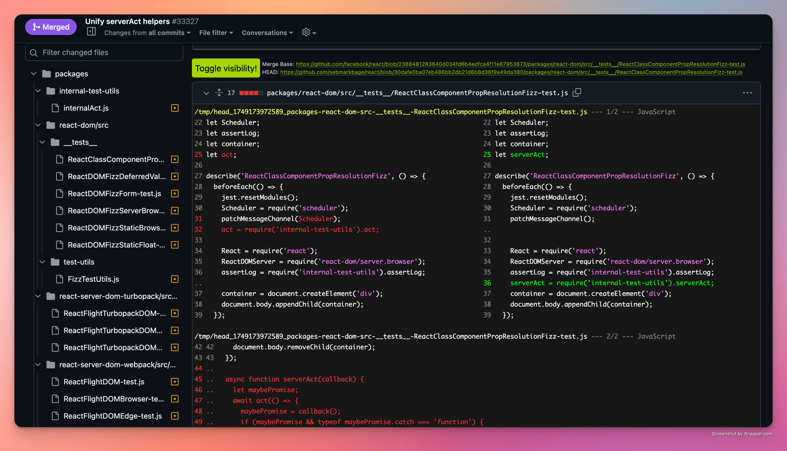

Amadiff is an open source browser extension that displays Github diffs using different diff tools. There are a lot of tools out there that can customize what git diffs look like, but all of them are constrained to the terminal as CLI tools. Amadiff brings those tools to the Github interface.


Get it on Chrome



Get it on Firefox


Supported tools so far: [Difftastic](https://difftastic.wilfred.me.uk/)

